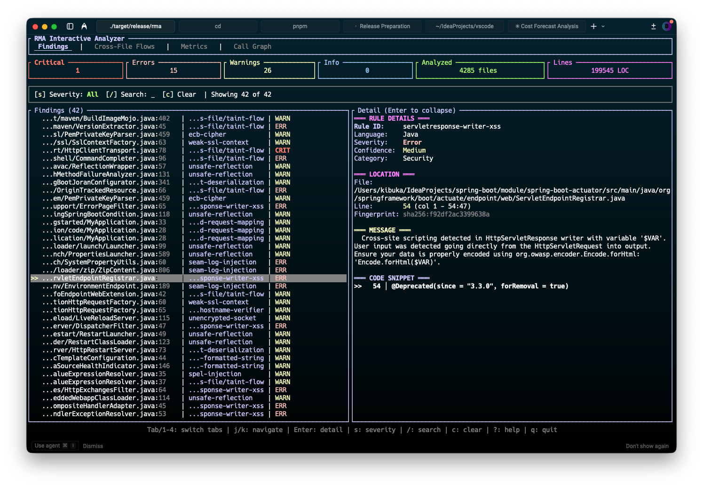
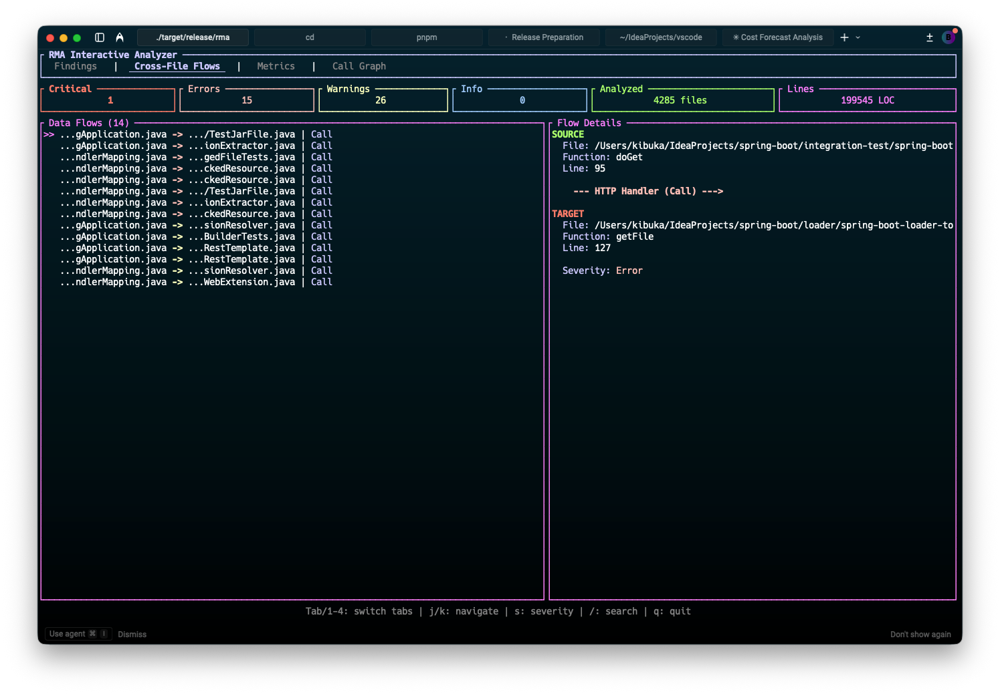
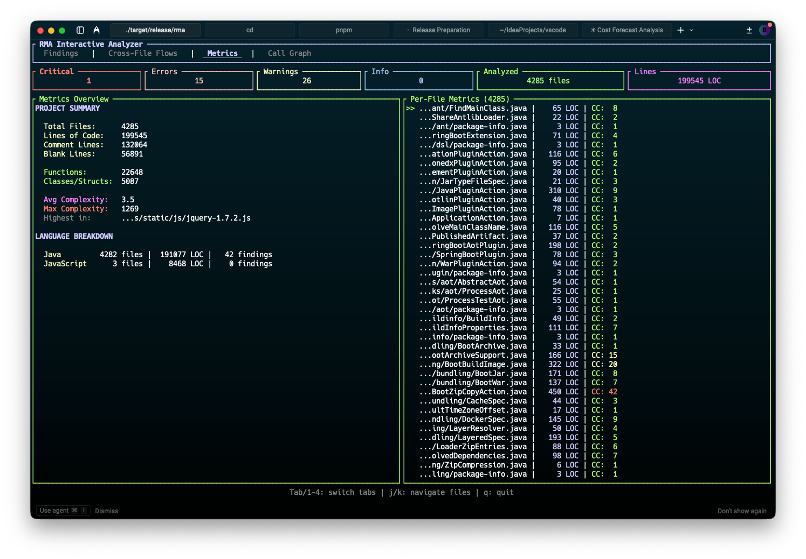
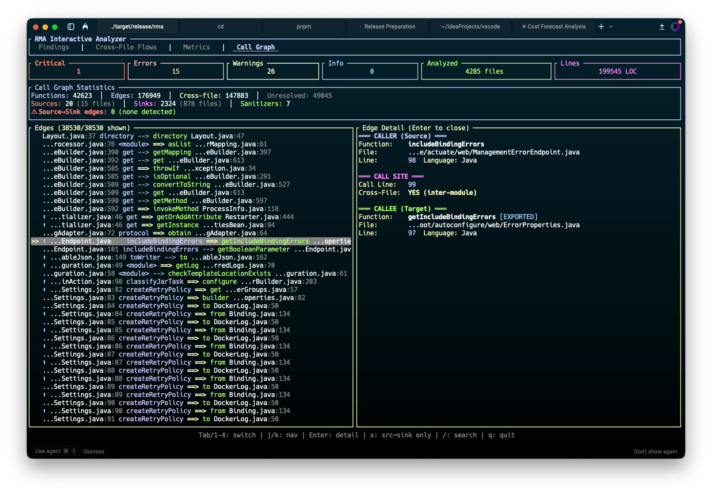

# RMA - Rust Monorepo Analyzer

[](https://github.com/bumahkib7/rust-monorepo-analyzer/actions/workflows/ci.yml)
[](https://github.com/bumahkib7/rust-monorepo-analyzer/releases)
[](https://www.npmjs.com/package/rma-cli)
[](https://crates.io/crates/rma-cli)
[](https://ghcr.io/bumahkib7/rma)
[](https://github.com/bumahkib7/homebrew-tap)
[](https://www.rust-lang.org)
[](LICENSE)

**Ultra-fast Rust-native code intelligence and security analysis platform for large enterprise monorepos.**

RMA leverages tree-sitter for polyglot parsing, rayon for parallelism, and tantivy for blazing-fast indexing to deliver sub-minute scans on million-LOC codebases.

## Quick Install

**npm (Node.js):**
```bash
npm install -g rma-cli
```

**Homebrew (macOS/Linux):**
```bash
brew tap bumahkib7/tap
brew install rma
```

**Cargo (Rust):**
```bash
cargo install rma-cli
```

**Shell Script (Linux/macOS):**
```bash
curl -fsSL https://raw.githubusercontent.com/bumahkib7/rust-monorepo-analyzer/master/install.sh | bash

# Install specific version
VERSION=0.16.0 curl -fsSL https://raw.githubusercontent.com/bumahkib7/rust-monorepo-analyzer/master/install.sh | bash
```

**Windows PowerShell:**
```powershell
iwr -useb https://raw.githubusercontent.com/bumahkib7/rust-monorepo-analyzer/master/install.ps1 | iex
```

**Docker:**
```bash
docker run -v $(pwd):/workspace ghcr.io/bumahkib7/rma scan /workspace
```

**GitHub Actions:**
```yaml
- uses: bumahkib7/rust-monorepo-analyzer@v0.16.0
  with:
    path: '.'
    upload-sarif: true
```

**Pre-commit:**
```yaml
# .pre-commit-config.yaml
repos:
  - repo: https://github.com/bumahkib7/rust-monorepo-analyzer
    rev: v0.16.0
    hooks:
      - id: rma
```

## Supported Languages

RMA supports 28+ programming languages with varying levels of analysis depth.

### Primary Languages (Full Analysis)

| Language | Extensions | Security Rules | Metrics | Framework Knowledge |
|----------|------------|----------------|---------|---------------------|
| Rust | `.rs` | unsafe, injection, crypto | ✓ | Actix, Axum, Rocket |
| JavaScript | `.js`, `.jsx`, `.mjs`, `.cjs` | XSS, injection, secrets | ✓ | Express, React, Vue |
| TypeScript | `.ts`, `.tsx`, `.mts`, `.cts` | XSS, injection, secrets | ✓ | Express, Next.js |
| Python | `.py`, `.pyi` | exec, injection, secrets | ✓ | Django, Flask, FastAPI |
| Go | `.go` | unsafe, SQL injection | ✓ | Gin, Echo, GORM |
| Java | `.java` | injection, crypto, deser | ✓ | Spring, Jakarta |

### Additional Languages (Parsing + Metrics)

The following languages have full tree-sitter parsing support with code metrics (LOC, complexity):

| Category | Languages |
|----------|-----------|
| JVM | Kotlin, Scala |
| Systems | C, C++, C# |
| Scripting | Ruby, PHP, Lua, Bash |
| Apple | Swift |
| Functional | Haskell, OCaml, Elixir |
| Web/Markup | HTML, CSS, SCSS |
| Data/Config | JSON, YAML, TOML, Markdown |
| Infrastructure | HCL/Terraform |
| Blockchain | Solidity |

## Features

### Core Analysis Engine

- **Semgrep Community Rules**: 647+ [Semgrep community rules](https://github.com/semgrep/semgrep-rules) compiled to native Rust matchers at build time
- **Polyglot Support**: Rust, JavaScript/TypeScript, Python, Go, Java with unified analysis
- **Parallel Parsing**: Multi-threaded AST parsing with tree-sitter and rayon
- **Cross-File Taint Tracking**: Interprocedural dataflow analysis across function and file boundaries
- **Typestate Analysis**: Resource lifecycle verification for files, connections, locks, and iterators
- **Field-Sensitive Analysis**: Track taint through struct fields and object properties
- **Context-Sensitive Analysis**: Path-sensitive analysis with calling context awareness
- **Alias/Points-To Analysis**: Track pointer and reference relationships
- **Callback & Async Propagation**: Taint tracking through callbacks, promises, and async/await
- **Symbolic Path Conditions**: Track conditions under which vulnerabilities are reachable

### Security Detection

- **Injection Attacks**: SQL injection, command injection, XSS, LDAP injection, template injection
- **Server-Side Vulnerabilities**: SSRF, path traversal, deserialization attacks
- **Secrets Detection**: Hardcoded API keys, passwords, tokens, and credentials
- **Cryptographic Issues**: Weak algorithms (MD5, SHA-1, DES, RC4), insecure modes (ECB)
- **Resource Safety**: Resource leaks, use-after-close, double-free detection
- **Null Pointer Analysis**: Potential null dereference detection
- **Unsafe Code Review**: Language-specific unsafe pattern detection (Rust unsafe, Go unsafe pkg)

### Vulnerability Scanning

- **OSV.dev Integration**: Real-time vulnerability database queries for known CVEs
- **5 Ecosystem Support**: Cargo (Rust), npm (JavaScript), PyPI (Python), Go modules, Maven (Java)
- **Import-Aware Reachability**: Only flag vulnerabilities in actually-used dependencies
- **CVSS Severity Scoring**: Prioritize findings by industry-standard severity metrics

### Framework Knowledge (20+ Frameworks)

| Language | Supported Frameworks |
|----------|---------------------|
| **Java** | Spring (Boot, MVC, Security), Jakarta EE, JDBC |
| **Go** | GORM, Gin, Echo, net/http, Chi |
| **JavaScript** | Express, Next.js, React, Vue, Prisma, Sequelize |
| **Python** | Django, Flask, FastAPI, SQLAlchemy |
| **Rust** | Actix-web, Axum, Rocket, Diesel |

### Developer Experience

- **Interactive TUI** (`--interactive`): Browse findings, call graphs, and metrics with keyboard navigation
  - **Findings Tab**: Navigate findings with `j/k`, view details with `Enter`, filter by severity with `s`
  - **Call Graph Tab**: Visualize function calls with security badges (`[SRC]`, `[SINK]`, `[SAN]`), press `x` to filter source→sink flows
  - **Metrics Tab**: View code complexity, LOC, and function counts per file
  - **Cross-File Flows Tab**: Explore taint flows across file boundaries
- **Analysis Caching**: Content-hash based caching for 10x faster re-scans (`--no-cache` to bypass)
- **Rich Diagnostics**: Rustc-style error output with source context, error codes, and fix suggestions
- **AI-Powered Analysis**: Optional AI-assisted vulnerability detection with `--ai` flag
- **Code Metrics**: Cyclomatic complexity, cognitive complexity, lines of code, maintainability index
- **Fast Indexing**: Tantivy-based full-text search across your codebase
- **Incremental Mode**: Only re-analyze changed files for fast iteration
- **Multiple Output Formats**: Text, JSON, SARIF, Compact, Markdown, GitHub annotations
- **Real-time Watch Mode**: WebSocket-based live updates with interactive keyboard controls
- **HTTP API**: Daemon mode with WebSocket support for IDE integration
- **IDE Integrations**: VS Code, Neovim, JetBrains, and Web Dashboard
- **Doctor Command**: Health check for RMA installation (`rma doctor`)
- **Duplicate Detection**: Find copy-pasted functions across your codebase
- **WASM Plugins**: Extend with custom analysis rules
- **Semgrep Rule Engine**: Rust-native execution of 647+ Semgrep community rules
- **Optional Providers**: PMD, Oxlint, Gosec for supplementary coverage
- **Shell Completions**: Bash, Zsh, Fish, PowerShell, Elvish

## Quick Start

```bash
# Scan current directory
rma scan .

# Interactive TUI mode - browse findings with keyboard
rma scan . --interactive

# Browse cross-file data flows interactively
rma flows . --interactive

# Scan with AI-powered analysis
rma scan ./src --ai

# Scan with JSON output for CI/CD
rma scan . --output json -f results.json

# Scan with SARIF output for GitHub Code Scanning
rma scan . --output sarif -f results.sarif

# Watch mode for continuous analysis
rma watch .

# Search indexed code
rma search "TODO" --type content

# View statistics
rma stats

# Check installation health
rma doctor

# Scan only changed files in a PR
rma scan . --changed-only
```

## CLI Commands

| Command | Alias | Description |
|---------|-------|-------------|
| `scan` | `s` | Security & code quality scanning with 50+ flags |
| `watch` | `w` | Real-time file monitoring with re-analysis |
| `flows` | `flow` | Cross-file taint flow visualization |
| `security` | `audit` | Comprehensive security audit (deps, Docker, code) |
| `fix` | `autofix` | Auto-fix vulnerable dependencies |
| `doctor` | - | Installation health diagnostics |
| `stats` | - | Repository metrics and statistics |
| `search` | `q` | Search indexed findings |
| `suppress` | - | Manage finding suppressions (add, list, remove, export, import) |
| `init` | - | Initialize RMA in a repository |
| `baseline` | - | Generate baseline for legacy code |
| `config` | - | Manage configuration (get, set, list, edit, validate) |
| `cache` | - | Manage vulnerability cache (status, clear) |
| `plugin` | - | WASM plugin management (list, install, remove, test) |
| `daemon` | - | HTTP daemon server with REST API + WebSocket |
| `bench` | `benchmark` | Performance benchmarking |
| `completions` | - | Shell completion generation |

### Scan Command - Full Options

```
rma scan [PATH] [OPTIONS]
```

**Output Options:**
| Flag | Description |
|------|-------------|
| `-f, --format <FORMAT>` | text, json, sarif, compact, markdown, github, html |
| `-o, --output <PATH>` | Output file (stdout if not specified) |
| `-i, --interactive` | Launch interactive TUI for browsing results |
| `--limit <NUM>` | Max findings to display (default: 20) |
| `--all` | Show all findings without limit |
| `--group-by <METHOD>` | Group by: file, rule, severity, none |

**Severity & Filtering:**
| Flag | Description |
|------|-------------|
| `--severity <LEVEL>` | Minimum: info, warning, error, critical |
| `--rules <PATTERNS>` | Filter by rule IDs (glob patterns) |
| `--exclude-rules <PATTERNS>` | Exclude specific rules |
| `--category <CAT>` | Filter: security, quality, performance, style |
| `--fixable` | Only show findings with fixes |
| `--high-confidence` | Only high-confidence findings |

**Analysis Configuration:**
| Flag | Description |
|------|-------------|
| `-p, --profile <NAME>` | Profile: fast, balanced, strict |
| `-j, --jobs <NUM>` | Parallel workers (0 = auto) |
| `--languages <LIST>` | Languages to scan (comma-separated) |
| `--cross-file` | Enable cross-file analysis |
| `--no-cache` | Disable analysis cache (force fresh analysis) |
| `--providers <LIST>` | rma, oxc, pmd, oxlint, rustsec, gosec, osv |

**AI Analysis:**
| Flag | Description |
|------|-------------|
| `--ai` | Enable AI-powered deep analysis |
| `--ai-provider <PROVIDER>` | claude, openai, local |

**Diff & PR Workflows:**
| Flag | Description |
|------|-------------|
| `--changed-only` | Scan only changed files |
| `--base <REF>` | Base git ref (default: origin/main) |
| `--diff` | Only findings on changed lines |
| `--diff-stdin` | Read diff from stdin |

**Test Files:**
| Flag | Description |
|------|-------------|
| `--include-tests` | Include test files (excluded by default) |
| `--skip-tests-all` | Skip ALL findings in test files |

**Smart Presets:**
| Flag | Description |
|------|-------------|
| `--preset-security` | Security rules, high confidence, warning+ |
| `--preset-ci` | Errors only, compact output |
| `--preset-review` | Warnings+, grouped by file |
| `--mode <MODE>` | local, ci, pr |

### Watch Options

```
rma watch [PATH] [OPTIONS]

Options:
  -d, --debounce <MS>       Debounce delay in milliseconds [default: 500]
  -l, --languages <LANGS>   Languages to watch
      --clear               Clear screen on each change
      --no-initial-scan     Skip initial directory scan (only show changes)
      --errors-only         Only show errors, not warnings
  -q, --quiet               Suppress non-essential output
```

**Interactive Keyboard Shortcuts:**

| Key | Action |
|-----|--------|
| `q` / `c` | Quit watch mode |
| `r` | Force re-scan of all files |
| `s` | Show current statistics |
| `e` | Toggle errors-only mode |
| `p` | Pause/resume watching |
| `?` | Show help |

## Output Formats

| Format | Use Case |
|--------|----------|
| `text` | Human-readable terminal output with rustc-style diagnostics |
| `json` | Machine-readable for programmatic processing |
| `sarif` | GitHub Code Scanning, Azure DevOps integration |
| `compact` | Minimal output for CI logs |
| `markdown` | Documentation and reports |
| `github` | GitHub Actions workflow commands (annotations) |

## Interactive TUI

Launch an interactive terminal interface for browsing analysis results:

```bash
rma scan . --interactive
# or
rma scan . -i
```

### Screenshots

**Findings Tab** - Browse security findings with severity filtering:


**Cross-File Flows Tab** - Visualize taint flows across files:


**Metrics Tab** - Code metrics and complexity analysis:


**Call Graph Tab** - Function calls with security badges:


**Call Graph Detail** - Detailed edge information with security warnings:


### Four Analysis Tabs

| Tab | Content |
|-----|---------|
| **Findings** | Security findings with rule metadata, severity, confidence, and full code snippets |
| **Cross-File Flows** | Taint flows spanning multiple files with source→sink paths |
| **Metrics** | Code metrics: LOC, complexity, function/class counts per file and language |
| **Call Graph** | Function calls with security badges, source→sink highlighting, and statistics |

### Keyboard Controls

**Navigation:**
| Key | Action |
|-----|--------|
| `Tab` / `1-4` | Switch tabs |
| `j/k` or `↑/↓` | Move up/down |
| `g/G` | Jump to first/last |
| `PgUp/PgDn` | Page scrolling |

**Filtering:**
| Key | Action |
|-----|--------|
| `/` | Enter search mode |
| `s` | Cycle severity filter |
| `c` | Clear all filters |
| `Enter` | Toggle detail view |
| `x` | Toggle source→sink filter (Call Graph tab) |

**Other:**
| Key | Action |
|-----|--------|
| `?` | Show help |
| `q` | Quit |

### Call Graph Features

The **Call Graph** tab provides deep visibility into function relationships:

- **Statistics Panel**: Total functions, edges, cross-file calls, sources, sinks, sanitizers
- **Security Badges**:
  - `[HTTP Handler]` - Taint source classification
  - `[SQL Injection]` - Sink vulnerability type
  - `[SAN]` - Function calls sanitizers
  - `⬆` - Exported/public function
  - `⚠` - Dangerous source→sink flow
- **Edge Detail Panel** (press `Enter`):
  - Full caller/callee info with file paths and line numbers
  - Security classification details
  - Confidence percentage
  - Remediation guidance for risky flows
- **Source→Sink Filter** (press `x`): Show only potentially dangerous flows

### Features
- Real-time statistics dashboard (critical/error/warning/info counts)
- Severity-colored findings with selection highlights
- Split-screen detail view with full code snippets, rule metadata, and fix suggestions
- Vim-style navigation
- Test files excluded by default

### Rich Diagnostics Output

RMA produces rustc-style diagnostic output with error codes, source context, and underline highlighting:

```
warning[RMA-Q501]: Function has 105 lines (max: 100) - consider refactoring
  --> src/analyzer.rs:219:5
217 │     }
218 │
219 │     fn check(&self, parsed: &ParsedFile) -> Vec<Finding> {
    │     ^^^^^^^^^^^^^^^^^^^^^^^^^^^^^^^^^^^^^^^^^^^^^^^^^^^^^^ function too long
    ... (104 more lines)
   = note: rule: generic/long-function

critical[RMA-S005]: SQL query built with format! - use parameterized queries instead
  --> src/database.rs:42:9
40 │     let user_input = get_input();
41 │
42 │     format!(
    │     ^^^^^^^^ SQL query built from untrusted input
43 │         "SELECT * FROM users WHERE name = '{}'",
44 │         user_input
   = note: rule: rust/sql-injection
```

### Error Codes

| Code Range | Category |
|------------|----------|
| RMA-S001-S999 | Security issues (unsafe, XSS, injection, etc.) |
| RMA-Q001-Q999 | Quality issues (complexity, length, style) |
| RMA-T001-T999 | Style issues (TODO, console.log, etc.) |
| RMA-J001-J999 | Java external tool findings (PMD) |

### GitHub Actions Integration

RMA provides a GitHub Action for easy CI/CD integration with automatic SARIF upload to GitHub Security tab.

#### Basic Usage

```yaml
name: Security Scan

on: [push, pull_request]

jobs:
  scan:
    runs-on: ubuntu-latest
    permissions:
      contents: read
      security-events: write

    steps:
      - uses: actions/checkout@v4

      - name: Run RMA Security Scan
        uses: bumahkib7/rust-monorepo-analyzer@v0.16.0
        with:
          path: '.'
          severity: 'warning'
          upload-sarif: 'true'
```

#### With PR Comments

```yaml
name: Security Scan

on: [push, pull_request]

jobs:
  scan:
    runs-on: ubuntu-latest
    permissions:
      contents: read
      security-events: write
      pull-requests: write

    steps:
      - uses: actions/checkout@v4

      - name: Run RMA Security Scan
        uses: bumahkib7/rust-monorepo-analyzer@v0.16.0
        with:
          path: '.'
          format: 'sarif'
          severity: 'warning'
          upload-sarif: 'true'
          comment-on-pr: 'true'
```

#### Action Inputs

| Input | Description | Default |
|-------|-------------|---------|
| `path` | Path to scan | `.` |
| `format` | Output format (text, json, sarif, compact, markdown, github) | `sarif` |
| `severity` | Minimum severity (info, warning, error, critical) | `warning` |
| `languages` | Comma-separated languages to scan | (all) |
| `ai` | Enable AI-powered analysis | `false` |
| `verbose` | Enable verbose output | `false` |
| `upload-sarif` | Upload SARIF to GitHub Security tab | `true` |
| `show-annotations` | Show GitHub annotations for findings | `true` |
| `fail-on-findings` | Fail workflow if findings detected | `false` |
| `version` | RMA version to use | `latest` |

#### Action Outputs

| Output | Description |
|--------|-------------|
| `sarif-file` | Path to generated SARIF file |
| `findings-count` | Number of security findings detected |

#### Manual SARIF Upload

```yaml
- name: Run RMA Security Scan
  run: rma scan . --output sarif -f results.sarif

- name: Upload SARIF
  uses: github/codeql-action/upload-sarif@v3
  with:
    sarif_file: results.sarif
```

## Architecture

```
rust-monorepo-analyzer/
├── crates/
│   ├── common/      # Shared types and utilities
│   ├── parser/      # Tree-sitter based polyglot parser
│   ├── rules/       # Semgrep rule compiler and matcher
│   ├── analyzer/    # Security and code analysis engine
│   ├── indexer/     # Tantivy/Sled based indexing
│   ├── cli/         # Command-line interface
│   ├── daemon/      # HTTP API server (Axum)
│   ├── plugins/     # WASM plugin runtime (Wasmtime)
│   ├── lsp/         # Language Server Protocol
│   └── ai/          # AI-powered analysis
```

### Component Overview

| Crate | Purpose |
|-------|---------|
| `rma-common` | Core types: Language, Severity, Finding, Config |
| `rma-parser` | Parallel AST parsing with tree-sitter |
| `rma-rules` | **Semgrep rule translator** - compiles YAML rules to native matchers |
| `rma-analyzer` | Flow analysis, metrics, and provider orchestration |
| `rma-indexer` | Full-text search and incremental updates |
| `rma-cli` | User-facing CLI binary |
| `rma-daemon` | Axum-based HTTP API server |
| `rma-plugins` | Wasmtime-based WASM plugin system |
| `rma-lsp` | Language Server Protocol implementation |
| `rma-ai` | AI-powered vulnerability detection |

## Rule Engine Architecture

RMA includes a **Rust-native Semgrep rule engine** - it does NOT shell out to Semgrep. Instead, it compiles [Semgrep community rules](https://github.com/semgrep/semgrep-rules) at build time and executes them using tree-sitter ASTs.

### How It Works

```
┌─────────────────────────────────────────────────────────────────────┐
│                         BUILD TIME                                   │
├─────────────────────────────────────────────────────────────────────┤
│                                                                      │
│   semgrep/semgrep-rules/**/*.yaml  ──►    build.rs (translator)     │
│   (Semgrep community rules)                     │                   │
│                                                 ▼                   │
│                                        Pattern Compilation          │
│                                                 │                   │
│                            ┌────────────────────┼────────────────┐  │
│                            ▼                    ▼                ▼  │
│                     TreeSitterQuery      LiteralSearch       Regex  │
│                     (~70% of rules)      (fastest)     (validated)  │
│                            │                    │                │  │
│                            └────────────────────┼────────────────┘  │
│                                                 ▼                   │
│                                    compiled_rules.bin (bincode)     │
│                                                 │                   │
│                                                 ▼                   │
│                                   Embedded via include_bytes!()     │
│                                                                      │
└─────────────────────────────────────────────────────────────────────┘

┌─────────────────────────────────────────────────────────────────────┐
│                          RUNTIME                                     │
├─────────────────────────────────────────────────────────────────────┤
│                                                                      │
│   Source File  ──►  tree-sitter  ──►  AST  ──►  Pattern Matching    │
│                                                        │            │
│   Embedded Rules  ──►  RuleRunner  ────────────────────┘            │
│                                                        │            │
│                                                        ▼            │
│                                                    Findings         │
│                                                                      │
└─────────────────────────────────────────────────────────────────────┘
```

### Why This Architecture?

| Benefit | Description |
|---------|-------------|
| **No Semgrep dependency** | RMA is a single binary - no need to install Semgrep |
| **Community-vetted rules** | Leverage 2500+ battle-tested Semgrep rules |
| **Build-time optimization** | Rules compiled to optimized matchers, not interpreted at runtime |
| **Zero startup cost** | Rules embedded in binary via `include_bytes!()` |
| **Consistent results** | Same rules, deterministic execution |

### Build-Time Compilation

The translator converts Semgrep YAML patterns into optimized matching strategies:

| Strategy | Use Case | Performance |
|----------|----------|-------------|
| `TreeSitterQuery` | AST pattern matching (`$FUNC(...)`) | Fast - native tree-sitter queries |
| `LiteralSearch` | Simple string patterns | Fastest - direct string search |
| `Regex` | Regex patterns | Fast - pre-compiled at build time |
| `AstWalker` | Complex patterns (`pattern-inside`, etc.) | Medium - full AST traversal |
| `Taint` | Source→sink tracking | Uses flow analysis engine |

### Supported Pattern Features

RMA supports the Semgrep pattern syntax:

| Feature | Example | Description |
|---------|---------|-------------|
| **Metavariables** | `$FUNC`, `$X` | Capture any expression |
| **Ellipsis** | `func(...)` | Match any arguments |
| **Typed ellipsis** | `$...ARGS` | Capture zero or more |
| **pattern-either** | OR matching | Match any of multiple patterns |
| **patterns** | AND matching | All patterns must match |
| **pattern-not** | Negation | Exclude matches |
| **pattern-inside** | Context | Match must be inside another pattern |
| **pattern-regex** | Regex | Regular expression matching |
| **metavariable-regex** | Constraint | Constrain captured value |
| **Taint mode** | `pattern-sources/sinks` | Source→sink tracking |

### Key Components

| Component | Location | Purpose |
|-----------|----------|---------|
| Rule Format | `crates/rules/src/format.rs` | Semgrep-compatible YAML schema |
| Translator | `crates/rules/build.rs` | Converts patterns → optimized matchers |
| Pattern Compiler | `crates/rules/src/pattern.rs` | Metavariable & ellipsis handling |
| Matcher | `crates/rules/src/matcher.rs` | Runtime pattern execution |
| Registry | `crates/rules/src/registry.rs` | Language-indexed O(1) lookup |
| Embedded Rules | `crates/rules/src/embedded.rs` | Zero-filesystem rule loading |

### Adding Custom Rules

You can add your own Semgrep-format rules:

```bash
# Create custom rules directory
mkdir -p .rma/rules

# Add a rule file (standard Semgrep YAML format)
cat > .rma/rules/my-rules.yaml << 'EOF'
rules:
- id: no-console-log
  message: "Remove console.log before committing"
  severity: WARNING
  languages: [javascript, typescript]
  pattern: console.log(...)
EOF

# Scan with custom rules
rma scan . --ruleset .rma/rules
```

## Security Rules

RMA uses **Semgrep community rules** - the same battle-tested rules used by thousands of organizations. Key coverage includes:

### Rust
- `rust/unsafe-block` - Detects unsafe blocks requiring manual review
- `rust/unwrap-used` - Detects .unwrap() calls that may panic
- `rust/panic-used` - Detects panic! macro usage
- `rust/sql-injection` - SQL query injection patterns
- `rust/command-injection` - Shell command injection

### JavaScript/TypeScript
- `js/dynamic-code` - Detects dangerous dynamic code execution (eval, Function)
- `js/innerHTML-xss` - Detects innerHTML/outerHTML XSS sinks
- `js/hardcoded-secret` - Detects hardcoded credentials
- `js/prototype-pollution` - Prototype pollution vulnerabilities
- `js/path-traversal` - File path manipulation

### Python
- `python/exec-usage` - Detects exec/compile/eval calls
- `python/shell-injection` - Detects subprocess shell=True patterns
- `python/hardcoded-secret` - Detects hardcoded credentials
- `python/sql-injection` - SQL string formatting
- `python/unsafe-deserialization` - Unsafe serialization loading

### Go
- `go/unsafe-usage` - Detects unsafe package usage
- `go/sql-injection` - Detects SQL injection patterns
- `go/command-injection` - exec with user input
- `go/path-traversal` - filepath.Join with user input
- `go/weak-crypto` - MD5, SHA1, DES usage

### Java
- `java/sql-injection` - JDBC string concatenation
- `java/command-injection` - Runtime.exec patterns
- `java/unsafe-deserialization` - ObjectInputStream vulnerabilities
- `java/xxe` - XML external entity injection
- `java/weak-crypto` - Insecure algorithms

### Generic (All Languages)
- `generic/todo-fixme` - Detects TODO/FIXME comments
- `generic/long-function` - Detects functions over 100 lines
- `generic/high-complexity` - Detects high cyclomatic complexity
- `generic/hardcoded-secret` - Detects API keys and passwords
- `generic/duplicate-function` - Detects copy-pasted functions (10+ lines)
- `generic/insecure-crypto` - Detects MD5, SHA-1, DES, RC4, ECB usage

## Data Flow Analysis

RMA includes a sophisticated data flow analysis engine for detecting complex vulnerabilities that span multiple files and functions.

### Taint Analysis
- **Forward taint propagation** tracking user-controlled data
- **Cross-file tracking** via call graph integration
- **Path-sensitive analysis** with three taint levels (Clean, Partial, Full)
- **Sanitizer recognition** that blocks taint propagation

### Interprocedural Analysis
- **Function summaries** capturing parameter-to-return taint flows
- **Context-sensitive analysis** for different calling contexts
- **Taint kinds**: UserInput, FilePath, SqlQuery, Command, Html, Url

### Typestate Analysis
Tracks object state transitions to detect:
- Use-after-close (reading from closed files)
- Resource leaks (missing cleanup)
- Invalid state transitions

Pre-built state machines for:
- Files (Unopened → Open → Closed)
- Connections (Created → Connected → Closed)
- Locks (Unlocked → Locked → Unlocked)
- Iterators (Created → Valid → Invalid)

### Advanced Features
- **Field-sensitive tracking** at property/field level
- **Alias analysis** for pointer/reference tracking
- **Implicit flow detection** for control-dependent leaks
- **Callback analysis** for async/Promise chains
- **Collection tracking** for arrays, maps, sets

### Visualize Flows
```bash
# Show cross-file taint flows
rma flows . --evidence --group-by sink-type

# Filter by sink type
rma flows . --sink-type sql --min-confidence 0.8
```

## HTTP API (Daemon Mode)

Start the daemon:

```bash
rma daemon --host 127.0.0.1 --port 9876
```

### Endpoints

| Method | Endpoint | Description |
|--------|----------|-------------|
| GET | `/health` | Health check |
| POST | `/api/v1/scan` | Scan a directory |
| POST | `/api/v1/analyze` | Analyze a single file |
| GET | `/api/v1/search` | Search indexed files |
| GET | `/api/v1/stats` | Get daemon statistics |
| POST | `/api/v1/index` | Trigger re-indexing |
| WS | `/ws/watch` | WebSocket for real-time updates |

### Example Request

```bash
curl -X POST http://localhost:9876/api/v1/scan \
  -H "Content-Type: application/json" \
  -d '{"path": "/path/to/repo", "languages": ["rust", "python"]}'
```

### WebSocket Real-time Updates

Connect to `/ws/watch` for real-time file change notifications and analysis results:

```javascript
const ws = new WebSocket('ws://localhost:9876/ws/watch');

ws.onmessage = (event) => {
  const msg = JSON.parse(event.data);
  switch (msg.type) {
    case 'FileChanged':
      console.log(`File changed: ${msg.data.path}`);
      break;
    case 'AnalysisComplete':
      console.log(`Analysis: ${msg.data.findings.length} findings`);
      break;
  }
};

// Start watching a directory
ws.send(JSON.stringify({ command: 'Watch', data: { path: '/path/to/repo' } }));
```

## IDE Integrations

RMA provides official integrations for popular editors and IDEs.

### VS Code Extension

```bash
# Install from VSIX
code --install-extension editors/vscode-rma/rma-vscode-*.vsix
```

Features:
- Real-time diagnostics as you type
- Problem panel integration
- Quick fixes and code actions
- Status bar with finding count

### Neovim Plugin

```lua
-- Using lazy.nvim
{
  dir = "editors/neovim-rma",
  config = function()
    require("rma").setup({
      daemon_url = "http://localhost:9876",
      auto_start_daemon = true,
    })
  end,
}
```

### JetBrains Plugin

Install from `editors/jetbrains-rma/` - supports IntelliJ IDEA, WebStorm, PyCharm, GoLand, and CLion.

### Web Dashboard

For browser-based real-time monitoring:

```bash
# Start the daemon
rma daemon

# Open the dashboard
open editors/web-dashboard/index.html
```

The web dashboard connects via WebSocket and shows live analysis results as you edit files.

## Plugin System

RMA supports WASM plugins for custom analysis rules:

```bash
# List installed plugins
rma plugin list

# Install a plugin
rma plugin install ./my-plugin.wasm

# Test a plugin
rma plugin test my-plugin --file src/main.rs

# Remove a plugin
rma plugin remove my-plugin
```

## Analysis Providers

RMA's core analysis is powered by its **Semgrep rule engine** (see [Rule Engine Architecture](#rule-engine-architecture)). Additionally, you can enable optional external tools for supplementary coverage.

### Available Providers

| Provider | Type | Languages | Description |
|----------|------|-----------|-------------|
| `rma` | Built-in | All | **Semgrep rule engine** - 647+ community rules compiled to native matchers (always enabled) |
| `osv` | Built-in | All | **OSV.dev** - Dependency vulnerability scanning for Cargo, npm, PyPI, Go, Maven |
| `oxc` | Built-in | JS/TS | **Oxc** - Rust-native JS/TS linting (520+ rules, no external binary) |
| `pmd` | External | Java | **PMD** - Java static analysis (requires PMD installation) |
| `oxlint` | External | JS/TS | **Oxlint** - JS/TS linting (requires oxlint installation) |
| `gosec` | External | Go | **Gosec** - Go security checker (requires gosec installation) |
| `rustsec` | Built-in | Rust | **RustSec** - Rust advisory database |

### Using Providers

```bash
# Default: rma (Semgrep rules) + osv (dependency scanning)
rma scan .

# Add external providers
rma scan . --providers rma,osv,pmd,gosec

# Security audit with all providers
rma security . --providers rma,osv,rustsec
```

### External Provider Setup

**PMD for Java:**
```bash
# Install PMD (https://pmd.github.io/)
brew install pmd  # or download from pmd.github.io

# Enable
rma scan . --providers rma,pmd
```

**Gosec for Go:**
```bash
# Install Gosec
go install github.com/securego/gosec/v2/cmd/gosec@latest

# Enable
rma scan . --providers rma,gosec
```

**Oxlint for JS/TS:**
```bash
# Install Oxlint
npm install -g oxlint

# Enable
rma scan . --providers rma,oxlint
```

## Dependency Vulnerability Scanning

RMA integrates with [OSV.dev](https://osv.dev) for comprehensive dependency vulnerability scanning across multiple package ecosystems.

### Supported Ecosystems

| Ecosystem | Lock File | Languages |
|-----------|-----------|-----------|
| crates.io | `Cargo.lock` | Rust |
| npm | `package-lock.json` | JavaScript/TypeScript |
| PyPI | `requirements.txt`, `poetry.lock` | Python |
| Go | `go.mod`, `go.sum` | Go |
| Maven | `pom.xml`, `build.gradle` | Java/Kotlin |

### Usage

```bash
# Run security audit including dependency scanning
rma security .

# With detailed CVE information
rma security . --details

# JSON output for CI/CD
rma security . --format json --fail-on high

# Offline mode (cache only)
rma security . --offline
```

### Features

- **Batch API queries** - Up to 1000 packages per request
- **24-hour cache** - Fast subsequent scans with configurable TTL
- **Import-aware reachability** - Higher confidence for actually imported packages
- **CVSS severity mapping** - Critical (≥9.0), High (≥7.0), Medium (≥4.0)
- **Offline mode** - Scan in air-gapped environments

### Auto-Fix Vulnerabilities

```bash
# Show fix plan (dry run)
rma fix .

# Apply fixes
rma fix . --apply

# Conservative patching (patch versions only)
rma fix . --strategy minimal --max-bump patch

# Create git branch and commit
rma fix . --apply --branch-name rma/fix-deps --commit
```

### Configuration

```toml
# rma.toml
[providers.osv]
include_dev_deps = false
cache_ttl = "24h"
enabled_ecosystems = ["crates.io", "npm", "PyPI", "Go", "Maven"]
offline = false

[providers.osv.severity_overrides]
"GHSA-xxxx-yyyy" = "warning"

[providers.osv.ignore_list]
"CVE-2024-xxxxx"
```

## Configuration

Initialize configuration:

```bash
rma init
```

This creates `rma.toml`:

```toml
# Config format version (required)
config_version = 1

[scan]
include = ["src/**", "lib/**"]
exclude = ["node_modules/**", "target/**", "dist/**"]
max_file_size = 10485760

[rules]
enable = ["*"]
disable = ["js/console-log"]

[rulesets]
security = ["js/xss-sink", "js/timer-string-eval", "rust/unsafe-block"]
maintainability = ["generic/long-function", "generic/high-complexity"]

[profiles]
default = "balanced"

[profiles.strict]
max_function_lines = 50
max_complexity = 10

[allow]
unsafe_rust_paths = ["src/ffi/**"]

[baseline]
file = ".rma/baseline.json"
mode = "all"  # or "new-only"

# Optional: External providers configuration
# [providers]
# enabled = ["rma", "pmd"]  # Providers to use
#
# [providers.pmd]
# pmd_path = "/usr/local/bin/pmd"  # Path to PMD installation
# rulesets = ["category/java/security.xml", "category/java/bestpractices.xml"]
# timeout_ms = 120000  # 2 minute timeout
# min_priority = 3  # 1-5, lower is more severe
```

### Inline Suppression

Suppress specific findings with comments:

```javascript
// rma-ignore-next-line js/xss-sink reason="content is sanitized"
element.textContent = processedContent;

// rma-ignore generic/long-function reason="complex algorithm"
function processData() { /* ... */ }
```

```python
# rma-ignore-next-line python/hardcoded-secret reason="test fixture"
TEST_API_KEY = "test-key-12345"
```
```

### Environment Variables

| Variable | Description |
|----------|-------------|
| `RMA_CONFIG` | Path to config file |
| `RMA_LOG` | Log level (trace, debug, info, warn, error) |
| `OPENAI_API_KEY` | API key for AI-powered analysis |
| `RMA_NO_COLOR` | Disable colored output |

## Shell Completions

Generate completions for your shell:

```bash
# Bash
rma completions bash > ~/.local/share/bash-completion/completions/rma

# Zsh
rma completions zsh > ~/.zfunc/_rma

# Fish
rma completions fish > ~/.config/fish/completions/rma.fish

# PowerShell
rma completions powershell > $PROFILE.CurrentUserAllHosts
```

## Development

```bash
# Build all crates
make build

# Run tests
make test

# Run lints
make lint

# Format code
make fmt

# Full CI check
make ci

# Scan RMA's own codebase
make self-scan

# Build documentation
make docs
```

## Benchmarks

```bash
# Run benchmarks
make bench

# Compare with Semgrep
hyperfine 'rma scan /path/to/repo' 'semgrep --config auto /path/to/repo'
```

## Roadmap

- [x] Multi-language tree-sitter parsing
- [x] Parallel analysis with rayon
- [x] SARIF output for CI/CD
- [x] Watch mode with interactive controls
- [x] HTTP API daemon with WebSocket support
- [x] WASM plugin system
- [x] AI-powered analysis
- [x] One-command installation
- [x] GitHub Actions integration
- [x] VS Code extension
- [x] Neovim plugin
- [x] JetBrains plugin
- [x] Web Dashboard
- [x] Doctor command
- [x] Duplicate function detection
- [ ] LSP integration
- [ ] Cloud SaaS deployment

## License

Licensed under either of:
- Apache License, Version 2.0 ([LICENSE-APACHE](LICENSE-APACHE))
- MIT License ([LICENSE-MIT](LICENSE-MIT))

at your option.

## Contributing

Contributions welcome! Please read [CONTRIBUTING.md](CONTRIBUTING.md) first.
