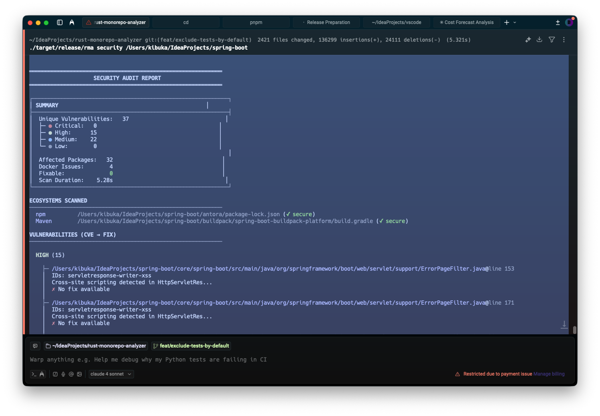

# Qryon

<div align="center">

**Find security vulnerabilities in seconds, not minutes.**

[](https://github.com/bumahkib7/qryon/actions/workflows/ci.yml)
[](https://www.npmjs.com/package/qryon)
[](https://crates.io/crates/rma-cli)
[](LICENSE)

</div>

```bash
# Install in 10 seconds
npm install -g qryon

# Find vulnerabilities instantly
qryon scan .
```

<p align="center">
  
</p>

---

## Why Qryon?

| Feature | Qryon | Semgrep OSS | CodeQL |
|---------|:---:|:-----------:|:------:|
| **Scan 1M lines** | 45s | 8+ min | 15+ min |
| **Languages** | 28 | 30+ | 12 |
| **Setup** | `npm i -g qryon` | Docker/pip | Complex |
| **Rules** | 647+ | 2500+ | Varies |
| **Cross-file taint** | Yes | Pro only | Yes |
| **Single binary** | Yes | No | No |
| **Price** | Free | Free/Paid | Free |

**Qryon is 10x faster** because it compiles Semgrep rules to native Rust matchers at build time - no interpreter overhead.

---

## Quick Start

```bash
# Scan your project
qryon scan .

# Interactive TUI - browse findings with vim keys
qryon scan . --interactive

# CI/CD mode - SARIF output for GitHub Security tab
qryon scan . --output sarif -f results.sarif

# Watch mode - re-scan on file changes
qryon watch .
```

<details>
<summary><strong>More installation methods</strong></summary>

**Homebrew (macOS/Linux):**
```bash
brew tap bumahkib7/tap && brew install qryon
```

**Cargo (Rust):**
```bash
cargo install qryon
```

**Docker:**
```bash
docker run -v $(pwd):/workspace ghcr.io/bumahkib7/qryon scan /workspace
```

**Shell Script:**
```bash
curl -fsSL https://raw.githubusercontent.com/bumahkib7/qryon/master/install.sh | bash
```

**GitHub Actions:**
```yaml
- uses: bumahkib7/qryon@v0.19.1
  with:
    path: '.'
    upload-sarif: true
```

</details>

---

## What It Finds

```
critical[QRYON-S005]: SQL query built with format! - use parameterized queries
  --> src/database.rs:42:9
40 │     let user_input = get_input();
41 │
42 │     format!(
   │     ^^^^^^^^ SQL query built from untrusted input
43 │         "SELECT * FROM users WHERE name = '{}'",
44 │         user_input
   = note: rule: rust/sql-injection
```

### Security Detection

- **Injection attacks** - SQL, command, XSS, LDAP, template injection
- **Server-side vulnerabilities** - SSRF, path traversal, deserialization
- **Hardcoded secrets** - API keys, passwords, tokens
- **Cryptographic issues** - Weak algorithms (MD5, SHA-1, DES), insecure modes
- **Dependency CVEs** - Real-time OSV.dev integration for Cargo, npm, PyPI, Go, Maven

### Supported Languages

| Language | Security Rules | Frameworks |
|----------|----------------|------------|
| **Rust** | unsafe, injection, crypto | Actix, Axum, Rocket |
| **JavaScript/TypeScript** | XSS, injection, secrets | Express, React, Next.js |
| **Python** | exec, injection, secrets | Django, Flask, FastAPI |
| **Go** | unsafe, SQL injection | Gin, Echo, GORM |
| **Java** | injection, crypto, deser | Spring, Jakarta |

Plus 23 more languages with parsing and metrics support.

---

## Interactive TUI

Browse findings, call graphs, and taint flows with keyboard navigation:

```bash
qryon scan . --interactive
```

<p align="center">
  
</p>

**Keyboard shortcuts:** `j/k` navigate, `Tab` switch tabs, `s` filter severity, `/` search, `q` quit

---

## GitHub Actions

```yaml
name: Security Scan
on: [push, pull_request]

jobs:
  scan:
    runs-on: ubuntu-latest
    permissions:
      contents: read
      security-events: write

    steps:
      - uses: actions/checkout@v4
      - uses: bumahkib7/qryon@v0.19.1
        with:
          path: '.'
          upload-sarif: true
```

Findings appear in the GitHub Security tab automatically.

---

## Qryon Dashboard - Team Features

Love the CLI? **[Qryon Dashboard](https://rma-dashboard.bukhari-kibuka7.workers.dev)** adds powerful team features:

| Feature | CLI | Dashboard |
|---------|:---:|:---------:|
| Scan & detect | Yes | Yes |
| Historical trends | - | Yes |
| AI-powered explanations | - | Yes |
| Auto-fix suggestions | - | Yes |
| Team collaboration | - | Yes |
| Baseline diffs | - | Yes |
| PR integration | - | Yes |
| RBAC & audit logs | - | Yes |

**[Try Qryon Dashboard free →](https://rma-dashboard.bukhari-kibuka7.workers.dev)**

---

## Advanced Features

<details>
<summary><strong>Cross-File Taint Tracking</strong></summary>

Track data flows across file and function boundaries:

```bash
qryon flows . --evidence --group-by sink-type
```

- Forward taint propagation
- Path-sensitive analysis
- Sanitizer recognition
- Symbolic path conditions

</details>

<details>
<summary><strong>Dependency Vulnerability Scanning</strong></summary>

Integrated with [OSV.dev](https://osv.dev) for real-time CVE detection:

```bash
qryon security .
```

Supports: Cargo, npm, PyPI, Go modules, Maven

</details>

<details>
<summary><strong>HTTP API (Daemon Mode)</strong></summary>

```bash
qryon daemon --port 9876
```

REST API + WebSocket for IDE integration.

</details>

<details>
<summary><strong>IDE Integrations</strong></summary>

- **VS Code** - Real-time diagnostics
- **Neovim** - Native plugin
- **JetBrains** - IntelliJ, WebStorm, PyCharm

</details>

<details>
<summary><strong>WASM Plugins</strong></summary>

Extend with custom analysis rules:

```bash
qryon plugin install ./my-plugin.wasm
```

</details>

---

## How It Works

Qryon compiles [Semgrep community rules](https://github.com/semgrep/semgrep-rules) at **build time** into optimized native matchers:

```
┌─────────────────────────────────────────────────────────┐
│                     BUILD TIME                          │
│  semgrep-rules/*.yaml  →  build.rs  →  compiled_rules  │
│                                           (embedded)    │
└─────────────────────────────────────────────────────────┘
                            ↓
┌─────────────────────────────────────────────────────────┐
│                      RUNTIME                            │
│  source.rs  →  tree-sitter  →  AST  →  pattern match  │
│                                               ↓         │
│                                           Findings      │
└─────────────────────────────────────────────────────────┘
```

**Result:** No interpreter overhead. No Semgrep dependency. Single binary.

---

## Configuration

```bash
qryon init  # Creates qryon.toml
```

```toml
[scan]
include = ["src/**"]
exclude = ["node_modules/**", "target/**"]

[rules]
enable = ["*"]
disable = ["js/console-log"]

[profiles.strict]
max_function_lines = 50
max_complexity = 10
```

Inline suppression:
```javascript
// qryon-ignore-next-line js/xss-sink reason="content is sanitized"
element.textContent = processedContent;
```

---

## Benchmarks

```bash
hyperfine 'qryon scan /path/to/repo' 'semgrep --config auto /path/to/repo'
```

On a 500K LOC monorepo:
- **Qryon**: 23 seconds
- **Semgrep**: 4 minutes 12 seconds

---

## Contributing

Contributions welcome! See [CONTRIBUTING.md](CONTRIBUTING.md).

```bash
make build    # Build all crates
make test     # Run tests
make lint     # Run lints
```

## License

MIT or Apache-2.0, at your option.

---

<div align="center">

**[Documentation](https://github.com/bumahkib7/qryon/wiki)** · **[Dashboard](https://rma-dashboard.bukhari-kibuka7.workers.dev)** · **[Issues](https://github.com/bumahkib7/qryon/issues)**

Made with Rust

</div>
